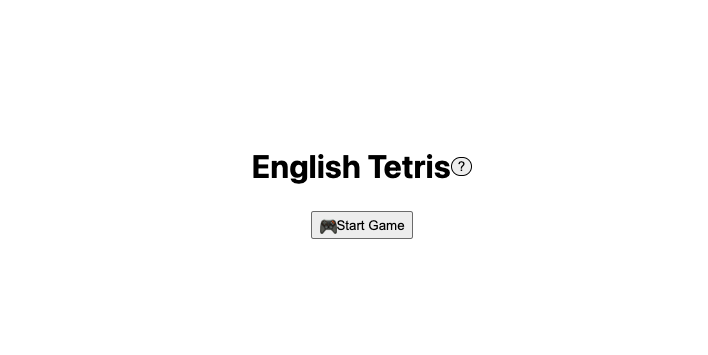
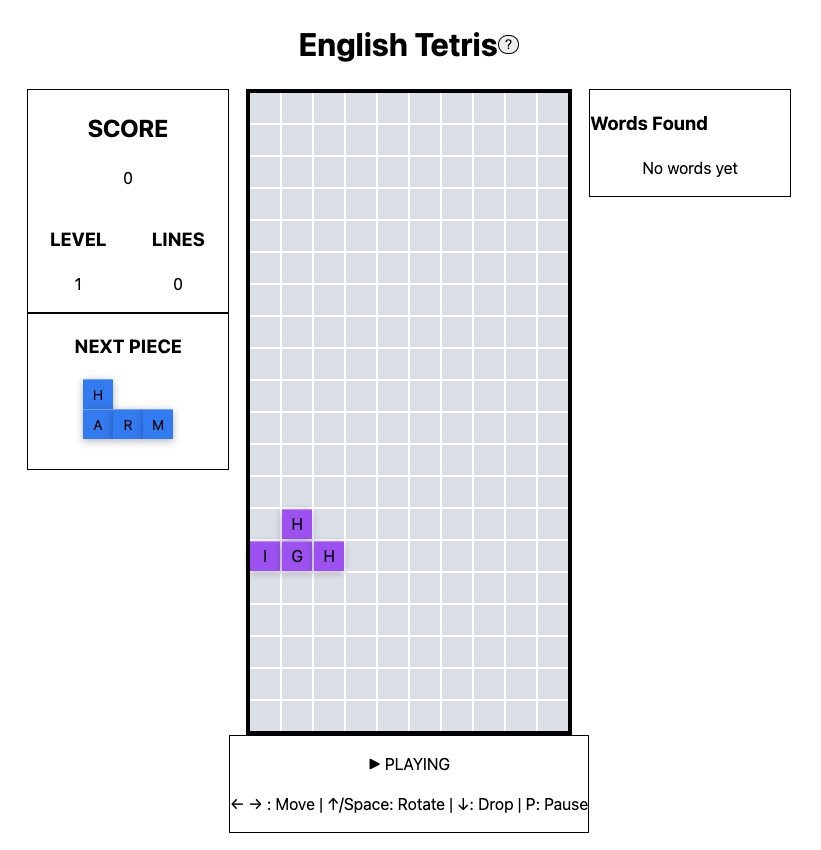
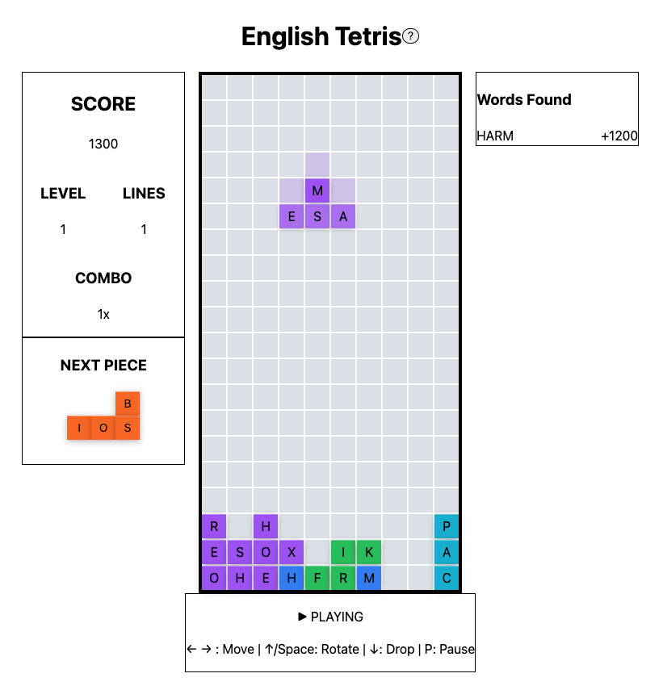
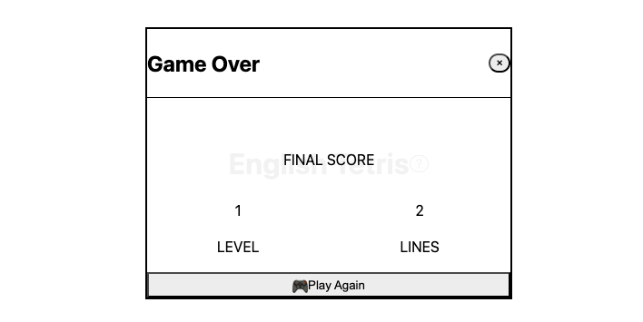

<div align="center">

# 🎮 English Tetris

### Learn English vocabulary while playing classic Tetris

[](https://english-tetris.vercel.app/)
[](https://github.com/oleonardodeandrade/english-tetris/releases/tag/v1.0.0)
[](https://vercel.com)
[](https://reactjs.org/)
[](https://www.typescriptlang.org/)
[](https://tailwindcss.com/)

[Play Now](https://english-tetris.vercel.app/) · [Report Bug](https://github.com/oleonardodeandrade/english-tetris/issues) · [Request Feature](https://github.com/oleonardodeandrade/english-tetris/issues)

</div>

---

## 📸 Screenshots

<div align="center">

### Initial Screen


### Gameplay


### Words Formation


### Game Over


</div>

---

## 🌟 About

**English Tetris** combines the addictive gameplay of classic Tetris with English vocabulary learning. Form words with letter-based Tetromino pieces, clear lines, and build combos while expanding your English vocabulary!

### ✨ Key Features

- 🎨 **Modern UI Design** - Vibrant gradients, glassmorphism effects, and smooth animations
- 🎮 **Classic Tetris Mechanics** - All 7 tetromino shapes with smooth controls
- 🔤 **Smart Letter Generation** - Uses real English word patterns for natural gameplay
- 📝 **Word Validation** - Real-time validation using comprehensive word dictionary
- 🏆 **Advanced Scoring System** - Points for lines cleared, words formed, and combo multipliers
- 📊 **Progress Tracking** - Track your words found, score, and level progression
- 🎯 **10,000+ Words Database** - Learn from a curated list of common English words
- 💎 **Professional Components** - Reusable Button and IconButton system with variants
- 🌈 **Beautiful Animations** - Smooth cubic-bezier transitions and celebration effects

---

## 🎮 How to Play

### Controls
- **← →** Move piece left/right
- **↑ / Space** Rotate piece
- **↓** Drop piece faster
- **P** Pause/Resume game

### Scoring
- **Line Clear**: 100 points per line
- **Word Formation**: Bonus points based on word length
- **Combo System**: Consecutive words multiply your score
- **Level Multiplier**: Higher levels = more points

### Objective
Clear lines to prevent the board from filling up, and form valid English words from the letters in cleared lines to earn bonus points and build combos!

---

## 🚀 Live Demo

**Play now at**: [https://english-tetris.vercel.app/](https://english-tetris.vercel.app/)

---

## 🛠️ Tech Stack

| Technology | Version | Purpose |
|------------|---------|---------|
| **React** | 19 | UI Framework |
| **TypeScript** | 5.9 | Type Safety |
| **Vite** | 7 | Build Tool |
| **Tailwind CSS** | 3 | Styling |
| **Vercel** | Latest | Deployment |

### Additional Tools
- ESLint for code quality
- Custom React hooks for game logic
- Type-safe game state management
- Responsive design for all devices

---

## 📦 Installation & Setup

### Prerequisites
- Node.js 18+
- npm or yarn

### Local Development

```bash
# Clone the repository
git clone https://github.com/oleonardodeandrade/english-tetris.git

# Navigate to project directory
cd english-tetris

# Install dependencies
npm install

# Start development server
npm run dev

# Open http://localhost:5173
```

### Production Build

```bash
# Build for production
npm run build

# Preview production build
npm run preview
```

---

## 📁 Project Structure

```
english-tetris/
├── src/
│   ├── components/
│   │   ├── game/          # Board, game mechanics
│   │   └── ui/            # UI components (Button, Modal, Cards)
│   ├── hooks/             # Custom React hooks (useGame, useKeyboard)
│   ├── services/          # Game logic and word validation
│   ├── data/              # Word database (10k+ words)
│   ├── types/             # TypeScript definitions
│   ├── utils/             # Helper functions
│   └── constants/         # Game configuration
├── public/                # Static assets
└── dist/                  # Production build
```

---

## 🎨 Design System

### Color Palette
- **Primary Gradient**: Purple → Pink → Orange
- **Glassmorphism**: Semi-transparent white with backdrop blur
- **Text**: White with gradient overlays for titles
- **Accents**: Purple, Pink, Blue gradients

### Components
- **Button**: 5 variants (primary, secondary, outline, ghost, gradient)
- **IconButton**: Circular icon-only buttons
- **Modal**: Backdrop blur with gradient titles
- **Cards**: Glassmorphism effect with depth shadows

### Animations
- Smooth cubic-bezier transitions
- Scale effects on hover/click
- Celebration animations for word formations
- Slide-in effects for new elements

---

## 🔧 Development Workflow

This project follows a professional Git workflow:

- **`main`** - Production-ready code
- **`develop`** - Integration and testing branch
- **`feat/*`** - Feature development branches
- **`fix/*`** - Bug fix branches
- **`style/*`** - UI/UX improvement branches

---

## 🚦 Roadmap

### v1.1 (Planned)
- [ ] Sound effects and background music
- [ ] Particle effects for word formations
- [ ] High score leaderboard (localStorage)
- [ ] Daily challenges
- [ ] Achievement system

### v1.2 (Future)
- [ ] Mobile touch controls
- [ ] Difficulty levels (Easy, Medium, Hard)
- [ ] Word definitions on hover
- [ ] Multi-language support
- [ ] PWA support for offline play

---

## 📄 License

This project is licensed under the **MIT License** - see the [LICENSE](LICENSE) file for details.

---

## 👨‍💻 Author

**Leonardo Andrade**

- GitHub: [@oleonardodeandrade](https://github.com/oleonardodeandrade)
- Project Link: [https://github.com/oleonardodeandrade/english-tetris](https://github.com/oleonardodeandrade/english-tetris)

---

## 🙏 Acknowledgments

- Inspired by classic Tetris gameplay
- Word list curated for English learners
- Built with modern web technologies
- Deployed on Vercel's edge network

---

<div align="center">

### ⭐ Star this repository if you found it helpful!

[Report Bug](https://github.com/oleonardodeandrade/english-tetris/issues) · [Request Feature](https://github.com/oleonardodeandrade/english-tetris/issues) · [Contribute](https://github.com/oleonardodeandrade/english-tetris/pulls)

Made with ❤️ by Leonardo Andrade

</div>
